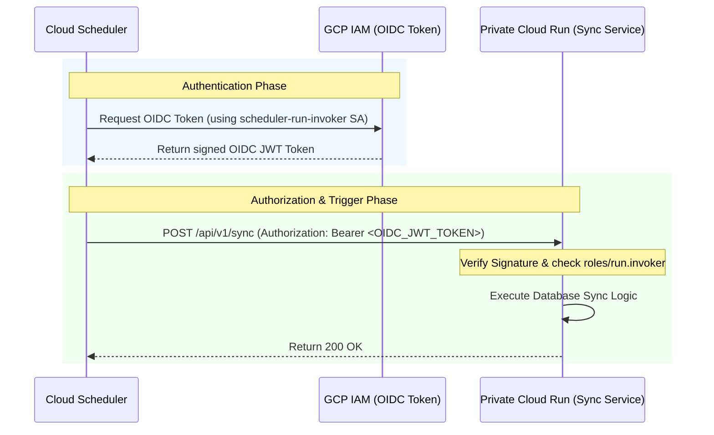

# GCP Secure Architecture Guide: Cloud Scheduler Triggering Cloud Run

This guide outlines the security design and the Google Cloud CLI (`gcloud`) commands to deploy a private **Movie Sync Service** on Cloud Run and configure **Cloud Scheduler** to trigger it securely using **OIDC (OpenID Connect)** token authentication.

---

## Architecture Design



### Security Principles:
1. **No Public Access**: The Cloud Run Sync service is deployed with `--no-allow-unauthenticated`.
2. **Principle of Least Privilege**: A dedicated Service Account is created solely for invoking this specific Cloud Run service.
3. **Cryptographic Authentication**: Cloud Scheduler automatically attaches an OIDC token signed by Google, which Cloud Run automatically validates.

---

## Step-by-Step Deployment Commands

Replace `<PROJECT_ID>` with your GCP project ID (e.g. `hami-review`).

### Step 1: Deploy the Sync Service as Private
Deploy the Cloud Run service ensuring public access is denied:
```bash
gcloud run deploy movie-sync-service \
  --image gcr.io/<PROJECT_ID>/movie-sync-service \
  --platform managed \
  --region asia-east1 \
  --no-allow-unauthenticated
```
*Note down the Service URL generated in the output (e.g., `https://movie-sync-service-xxxx-de.a.run.app`).*

### Step 2: Create a Dedicated Service Account
Create a service account specifically for the Cloud Scheduler job:
```bash
gcloud iam service-accounts create scheduler-run-invoker \
  --display-name="Cloud Scheduler Run Invoker"
```

### Step 3: Grant Invoker Permissions on Cloud Run
Grant the service account permission to call the `movie-sync-service` Cloud Run instance:
```bash
gcloud run services add-iam-policy-binding movie-sync-service \
  --member="serviceAccount:scheduler-run-invoker@<PROJECT_ID>.iam.gserviceaccount.com" \
  --role="roles/run.invoker" \
  --region=asia-east1
```

### Step 4: Create the Cloud Scheduler Job with OIDC Token
Configure Cloud Scheduler to call your service securely. It will automatically fetch and sign an OIDC token using the service account before calling the HTTP URL:
```bash
gcloud scheduler jobs create http movie-sync-daily-job \
  --schedule="0 3 * * *" \
  --uri="https://movie-sync-service-xxxx-de.a.run.app/api/v1/sync" \
  --http-method=POST \
  --oidc-service-account-email="scheduler-run-invoker@<PROJECT_ID>.iam.gserviceaccount.com" \
  --oidc-token-audience="https://movie-sync-service-xxxx-de.a.run.app/api/v1/sync" \
  --time-zone="Asia/Taipei"
```

*Parameters explained:*
- `--schedule="0 3 * * *"`: Runs daily at 03:00 AM Taipei time.
- `--oidc-service-account-email`: The service account created in Step 2.
- `--oidc-token-audience`: Must match the target service's base URL (audience verification is done by Cloud Run).
